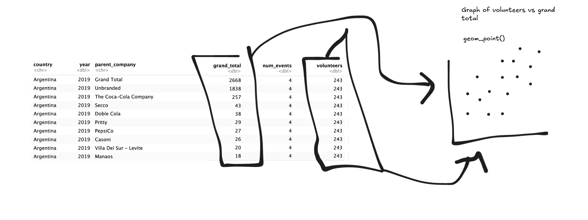
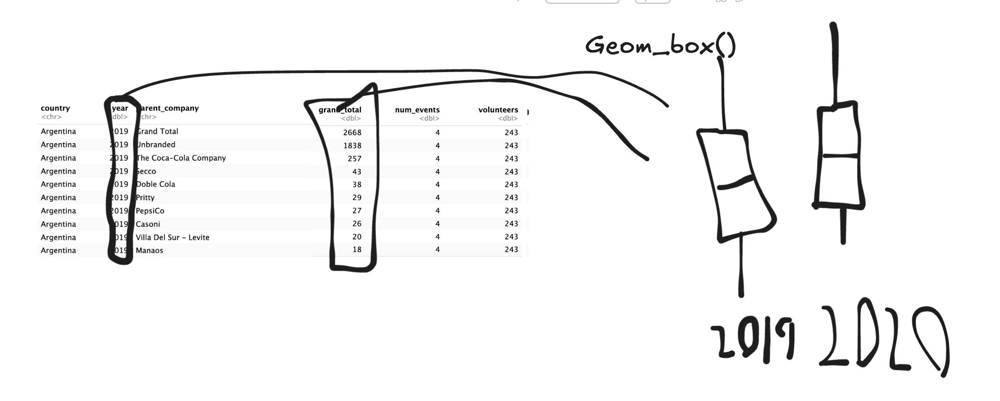

#First file for repo

```{r}
plastics <- readr::read_csv('https://raw.githubusercontent.com/rfordatascience/tidytuesday/main/data/2021/2021-01-26/plastics.csv')
plastics
```

This data has been cleaned by combining a bunch of datasets and then it makes the columns all the same data types the makes all the variable names the same. It adds a year variable as will and grand total. It does the same for 2019 data then it combines all of them.

Research Questions with data:

Does type of plastic effect the total amount cleaned up?

Does more volunteers necessarily mean more plastic waste cleaned up?

Research Questions with supplemental data:

Does the time of year affect grand total plastic cleanup amount?

Does the income of the volunteers effect plastic cleanup amount?




